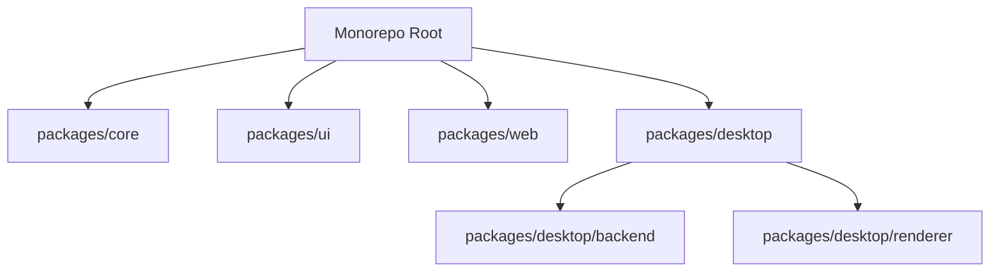

# CincoScribe Monorepo Specifications

CincoScribe is a local-first, privacy-focused desktop and web application designed for offline audio transcription (ASR), text-to-speech (TTS) generation, and audio merging. It runs 100% locally on the user's device without mandatory cloud dependency, user tracking, or required subscriptions.

---

## 1. Project Overview & Architecture

The project is structured as a monorepo containing multiple packages under `packages/*` and a root web application that serves both as a standalone web version and the source code for building the Electron distribution.

### Key Technologies
- **Frontend**: Vanilla HTML5, CSS3 (using OKLCH color spaces), and Vanilla JavaScript (SPA hash router).
- **Desktop Runtime**: Electron 43.0.0.
- **Backend (Sidecar)**: FastAPI Python backend running Whisper (ASR) and TTS engines locally.
- **Dependency & Package Management**: npm workspaces, `uv` for python environments.

---

## 2. Monorepo Package Structures

### `@cincoscribe/core` (`packages/core`)
Contains shared, framework-agnostic Constants, schemas, and types.
- **`src/index.js`**: Exports the core sidecar configuration:
  - `SIDECAR_PORT`: `3901`
  - `SIDECAR_BASE`: `http://127.0.0.1:3901`

### `@cincoscribe/ui` (`packages/ui`)
Shared component library built with React and Tailwind CSS.
- **`src/KofiButton.jsx`**: A lightweight Ko-fi tip anchor button component. Defaults to the developer handle `vinayaka`.

### `@cincoscribe/web` (`packages/web`)
Next.js 14 frontend package stub representing the future cloud-enabled web application.

### `@cincoscribe/desktop` (`packages/desktop`)
The primary Electron app distribution package.
- **`main.js`**: Starts the Electron main process, spawns the FastAPI sidecar backend via `uv run main.py`, and boots the GUI window targeting `renderer/index.html`.
- **`preload.js`**: Preload script defining the secure IPC boundary.
- **`backend/`**: FastAPI python backend wrapping:
  - **ASR (Automatic Speech Recognition)**: Uses local ONNX Whisper models (`whisper-tiny` for Fast mode, `whisper-base` for Accuracy mode) running locally on CPU via WebAssembly.
  - **TTS (Text to Speech)**: Handles local speech synthesis.
- **`renderer/`**: The vanilla JS frontend assets copied and loaded inside the Electron shell.

---

## 3. Root Web Application (Static Build Source)

The root folder contains a complete vanilla JS single-page web app.
- **`index.html`**: Root viewport loading CSS tokens and routing scripts.
- **`landing.html`**: Static landing/marketing page. Displays app features, FAQs, specifications, and plans.
- **`css/`**: Styling modules:
  - `variables.css`: Defines structural tokens and color palettes.
  - `base.css`: Base layouts and app shell.
  - `sidebar.css` & `components.css`: Sidebar nav and modular custom UI styling.
- **`js/`**: Application page controllers:
  - `router.js`: Custom hash router (`#/dashboard/...`).
  - `pages/transcribe.js`: Drag-and-drop local audio upload and Whisper transcription manager.
  - `pages/text-to-voice.js`: Speech synthesis dashboard.
  - `pages/merge-audio.js`: Segmented audio concatenation panel.
  - `pages/history.js`: Local storage-based transcription log.
  - `pages/settings-modal.js`: OpenAI key overrides, default language selectors, and model configurations.
- **`build.js`**: The packaging pipeline script. Clean-copies root web assets, obfuscates critical JS pages, and triggers `electron-builder` to compile the final Windows NSIS installer.

---

## 4. Tiers & Payment Model

CincoScribe operates on a hybrid local-free/cloud-premium pricing strategy:
- **Free Tier (Local Free)**:
  - Fully featured, unlimited transcription and audio tools.
  - 100% offline and private.
  - No signup, license key, or activation code required.
- **Cloud Tier (Pro - Coming Soon)**:
  - Adds online syncing, remote data backup, cross-device access, and a web dashboard.
- **Passive Support**:
  - Tip button linking to `https://ko-fi.com/vinayaka` added inside the settings dashboard and landing page.
